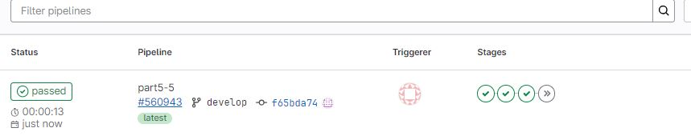

### Part 1. Настройка **gitlab-runner**

##### Подними виртуальную машину *Ubuntu Server 22.04 LTS*.


##### [Скачай](https://docs.gitlab.com/runner/install/linux-manually.html) и установи на виртуальную машину **gitlab-runner**.
##### Запусти **gitlab-runner** и зарегистрируй его для использования в текущем проекте (*DO6_CICD*).
1. Загрузить бинарный файл <br>
```sh
sudo curl -L --output /usr/local/bin/gitlab-runner "https://s3.dualstack.us-east-1.amazonaws.com/gitlab-runner-downloads/latest/binaries/gitlab-runner-linux-amd64"
```
2. Дать файлу разрешение на исполнение: <br>
```sh
sudo chmod +x /usr/local/bin/gitlab-runner
```
3. Создать пользователя GitLab CI <br>
```sh
sudo useradd --comment 'GitLab Runner' --create-home gitlab-runner --shell /bin/bash
```
4. Установить как службу <br>
```sh
sudo gitlab-runner install --user=gitlab-runner --working-directory=/home/gitlab-runner
```
5. Запустить службу
```sh
sudo gitlab-runner start
```


##### Для регистрации понадобятся URL и токен, которые можно получить на страничке задания на платформе.


1. <i>Enter the Gitlab instance URL:</i>
```sh
https://repos.21-school.ru
```
2. <i>Enter the registration token:</i>
```sh
****48941j6cBUDtCs-rb-7hbtXhc
```
3. <i>Enter the desctription for the runner</i> (Описание для GitLab Runner обычно используется, чтобы быстро идентифицировать его среди других раннеров.):
```sh
DO6_CICD
``` 
4. <i>Enter tags for the runner</i> (Теги для GitLab Runner используются для того, чтобы направлять задачи на конкретные Runner'ы в зависимости от их возможностей или предназначения.):
```sh
build, style, test, deploy, 
```  
5. <i>Enter the executor</i> (Для GitLab Runner'а необходимо выбрать тип <b>executor</b> (исполнителя), который определяет, как задачи будут выполняться.):
```sh
shell
```  


### Part 2. Сборка

#### Напиши этап для **CI** по сборке приложений из проекта *C2_SimpleBashUtils*.

##### В файле _gitlab-ci.yml_ добавь этап запуска сборки через мейк файл из проекта _C2_.

##### Файлы, полученные после сборки (артефакты), сохрани в произвольную директорию со сроком хранения 30 дней.


##### После пуша в Gitlab видим ошибку в pipline:
```sh
Running with gitlab-runner 17.4.0 (b92ee590)
  on DO6_CICD Xy824Lhj, system ID: s_5cf8daa66f90
Preparing the "shell" executor
Using Shell (bash) executor...
Preparing environment
Running on serv1...
ERROR: Job failed: prepare environment: exit status 1. Check https://docs.gitlab.com/runner/shells/index.html#shell-profile-loading for more information
``` 

<i>Ошибка Job failed: prepare environment: exit status 1 означает, что Runner не смог корректно подготовить окружение для выполнения задания при использовании "shell" executor.</i>

Исправляем ошибку внеся изменения в файл /home/gitlab-runner/.bash_logout


Также устанавливаем утилиты для сборки проекта
```sh
sudo apt install make clang-format
``` 
#### Теперь проект собирается корректно:


### Part 3. Тест кодстайла

#### Напиши этап для **CI**, который запускает скрипт кодстайла (*clang-format*).

##### Если кодстайл не прошел, то «зафейли» пайплайн.

##### В пайплайне отобрази вывод утилиты
*clang-format*.<br>


##### Исправим ошибки Google style и проверим пайплан:


### Part 4. Интеграционные тесты

#### Напиши этап для **CI**, который запускает твои интеграционные тесты из того же проекта.

##### Запусти этот этап автоматически только при условии, если сборка и тест кодстайла прошли успешно.

##### Если тесты не прошли, то «зафейли» пайплайн.

##### В пайплайне отобрази вывод, что интеграционные тесты успешно прошли / провалились.
 - провально
    - локально<br>
  <br>

    - пайплайн<br>
  <br>
  <br>

 - успешно<br>
    - локально<br>
  <br>

    - пайплайн<br>
  <br>

### Part 5. Этап деплоя

##### Подними вторую виртуальную машину *Ubuntu Server 22.04 LTS*.
  

##### Установим статическую маршрутизацию между двумя машинами
 - выполним настройки на стороне виртальных машин:<br>
 

 - Изменим файлы /etc/netplan/00-installer-config.yaml:<br>
    - server1 <br>
 
   - server 2 <br>
 

 - Проверим связь:<br>
 
 

##### Устновим ssh соединение между двумя машинами
 - Логинимся в первой машине под пользователем gitlab-runner:
```sh
sudo su gitlab-runner
``` 
 - Создаем ключ SSH:
```sh
ssh-keygen
``` 
 - Копируем ключ на вторую машину:
```sh
ssh-copy-id ruslan@10.10.0.2
``` 
 

 - Благодаря скопированному ключу мы можем подключаться ко второй машине без ввода пароля, использовав лишь команду:
```sh
ssh ruslan@10.10.0.2
``` 

#### Напиши этап для **CD**, который «разворачивает» проект на другой виртуальной машине.
##### Запусти этот этап вручную при условии, что все предыдущие этапы прошли успешно.
##### Напиши bash-скрипт, который при помощи **ssh** и **scp** копирует файлы, полученные после сборки (артефакты), в директорию */usr/local/bin* второй виртуальной машины.


##### В файле _gitlab-ci.yml_ добавь этап запуска написанного скрипта.
 
##### Видим, что в пайплайне отрабатывают все этапы, кроме последнего.
 
 ##### Запустим этап deploy вручную:
 
В результате ты должен получить готовые к работе приложения из проекта *C2_SimpleBashUtils* (s21_cat и s21_grep) на второй виртуальной машине.
 
##### Сохрани дампы образов виртуальных машин.

 

### Part 6. Дополнительно. Уведомления

##### Настрой уведомления об успешном/неуспешном выполнении пайплайна через бота с именем «[твой nickname] DO6 CI/CD» в *Telegram*.

- Текст уведомления должен содержать информацию об успешности прохождения как этапа **CI**, так и этапа **CD**.
- В остальном текст уведомления может быть произвольным.
- Создаем бота
 

- Получаем ID чата с ботом перейдя по ссылке https://api.telegram.org/bot7581559629:AAEZrFGih3arFFEEh7rI9V5VjGbLPgelj08/getUpdates и написав любое сообщение боту:
 

 - Полученный ранее токен и ID чата понадобятся для напимсания скрипта

 - Напишем скрипт вызова бота telegram-notification.sh и добавим в файл .gitlab-ci.yml выполнение скрипта после каждого этапа:
 
  
- Проверяем работу бота:
 
  
  